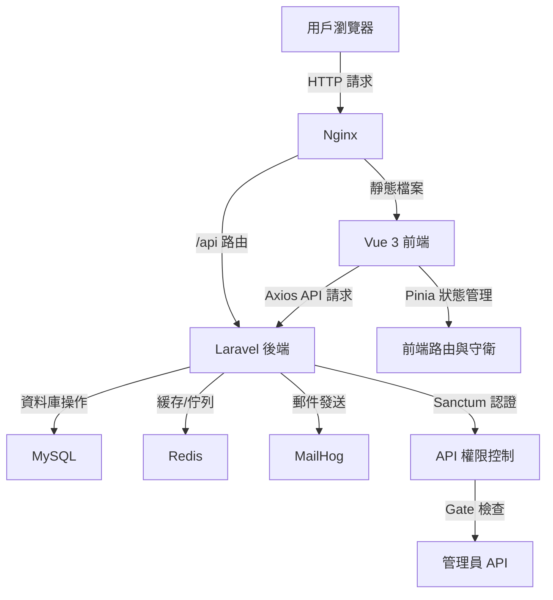

# SaaS Boilerplate - 全棧應用基礎架構

這是一個簡單實用的 SaaS 應用骨架，基於 **Laravel 後端 API** 和 **Vue 3 前端 SPA** 搭建，目標是讓開發者能快速啟動一個帶有用戶認證、訂閱管理和容器化部署的專案。架構清楚，功能扎實，適合用來開發中小型 SaaS 產品。

## 專案特色

- **前後端分離**：後端用 Laravel 提供穩定的 RESTful API，前端用 Vue 3 打造流暢的單頁應用，各自獨立，方便維護和未來擴展。
- **用戶與訂閱管理**：內建用戶、訂閱方案和訂閱模型，支援基本的註冊、登入和訂閱功能，為未來的支付網關（如 Stripe、PayPal）整合和更複雜的訂閱生命週期管理（如試用期、續訂、升級/降級）奠定基礎，管理員也能操作用戶和方案。
- **權限控制**：後端用 Laravel Gate 確保只有管理員能訪問敏感 API，前端用 Vue Router 守衛做額外的權限檢查，確保安全性。
- **容器化環境**：用 Docker Compose 整合 Laravel、Vue、MySQL、Redis 和 MailHog，實現開發環境的快速啟動和跨平台一致性，解決「在我電腦上可以跑」的問題。
- **自動化測試**：支援 PHPUnit、PHPStan、Vitest 和 ESLint，搭配 GitHub Actions 實現 CI/CD，確保每次程式碼提交都能自動進行質量檢查，提高程式碼品質和減少錯誤。
- **API 文件**：整合 L5-Swagger，自動生成清晰的 API 文件，方便開發、測試和與第三方整合。

## 架構流程圖

以下是專案的架構圖，展示前後端如何互動，以及主要服務的關係：



- **說明**：
  - 用戶透過瀏覽器訪問應用，Nginx 負責分發請求：靜態檔案給 Vue 前端，`/api` 請求給 Laravel 後端。
  - Vue 前端使用 Axios 與後端 API 互動，Pinia 管理用戶狀態，路由守衛控制頁面訪問權限。
  - Laravel 後端處理業務邏輯，透過 Sanctum 驗證 token，使用 Gate 控制管理員 API 訪問。
  - MySQL 儲存用戶、方案和訂閱資料；Redis 處理緩存和佇列；MailHog 捕獲開發環境的郵件。

## 專案結構

```
.
├── backend/                  # Laravel 後端
│   ├── app/
│   │   ├── Http/
│   │   │   ├── Controllers/Api/  # API 控制器
│   │   │   │   ├── AuthController.php
│   │   │   │   ├── SubscriptionController.php
│   │   │   │   └── Admin/
│   │   │   │       ├── UserController.php
│   │   │   │       └── PlanController.php
│   │   │   ├── Middleware/       # 自定義中介層
│   │   │   │   └── CheckUserRole.php
│   │   │   ├── Requests/         # 表單驗證
│   │   │   │   ├── Auth/
│   │   │   │   └── Admin/
│   │   ├── Models/               # 資料模型
│   │   │   ├── User.php
│   │   │   ├── Plan.php
│   │   │   └── Subscription.php
│   │   ├── Providers/            # 服務提供者
│   │   │   └── AuthServiceProvider.php
│   ├── config/                   # 設定檔
│   ├── database/                 # 資料庫遷移與種子
│   ├── routes/
│   │   ├── api.php               # API 路由
│   │   └── web.php
│   ├── Dockerfile                # 後端 Docker 設定
│   └── .env.example
├── frontend/                 # Vue 3 前端
│   ├── src/
│   │   ├── assets/               # 靜態資源
│   │   ├── components/           # UI 元件
│   │   ├── router/
│   │   │   └── index.js          # Vue Router
│   │   ├── stores/               # Pinia 狀態管理
│   │   │   ├── auth.js
│   │   │   └── subscription.js
│   │   ├── views/                # 頁面組件
│   │   │   ├── Auth/
│   │   │   ├── DashboardView.vue
│   │   │   └── Admin/
│   │   ├── App.vue
│   │   └── main.js
│   ├── Dockerfile                # 前端 Docker 設定
│   ├── tailwind.config.js        # Tailwind CSS 設定
│   └── vite.config.ts
├── nginx/                    # Nginx 設定
│   └── nginx.conf
├── .github/workflows/        # GitHub Actions CI/CD
│   └── main.yml
└── docker-compose.yml        # Docker Compose 設定
```

## 環境需求

- Git
- Docker & Docker Compose
- 基本的 Bash 指令操作能力

## 啟動步驟

請按照以下步驟手動設置並啟動專案：

### 1. 克隆專案

```bash
git clone https://github.com/BpsEason/saas-boilerplate.git
cd saas-boilerplate
```

### 2. 設定後端

進到 `backend` 資料夾，準備 Laravel 環境：

```bash
cd backend
cp .env.example .env
composer install
php artisan key:generate
composer require laravel/sanctum darkaonline/l5-swagger
php artisan vendor:publish --provider="Laravel\Sanctum\SanctumServiceProvider" --tag="sanctum-migrations"
php artisan vendor:publish --provider="L5Swagger\L5SwaggerServiceProvider"
cd ..
```

### 3. 設定前端

進到 `frontend` 資料夾，安裝 Node.js 依賴：

```bash
cd frontend
npm install
cd ..
```

### 4. 啟動 Docker

在專案根目錄啟動所有服務：

```bash
docker compose up -d --build
```

### 5. 執行資料庫遷移

跑遷移和種子，初始化資料庫：

```bash
docker compose exec app php artisan migrate --seed
```

### 6. 生成 API 文件

專案使用 L5-Swagger 自動生成 API 文件。請確保在 `app/Http/Controllers` 中的控制器方法有正確的 Swagger 註解（見下方範例），然後執行以下命令生成文件：

```bash
docker compose exec app php artisan l5-swagger:generate
```

**Swagger 註解範例**（可在 `backend/app/Http/Controllers/Api/Auth/AuthController.php` 中添加）：

```php
/**
 * @OA\Post(
 *     path="/api/register",
 *     summary="註冊新用戶",
 *     tags={"認證"},
 *     @OA\RequestBody(
 *         required=true,
 *         @OA\JsonContent(
 *             required={"name","email","password"},
 *             @OA\Property(property="name", type="string", example="John Doe"),
 *             @OA\Property(property="email", type="string", format="email", example="user@example.com"),
 *             @OA\Property(property="password", type="string", format="password", example="password123")
 *         )
 *     ),
 *     @OA\Response(
 *         response=201,
 *         description="註冊成功",
 *         @OA\JsonContent(ref="#/components/schemas/User")
 *     ),
 *     @OA\Response(
 *         response=422,
 *         description="驗證失敗",
 *         @OA\JsonContent()
 *     )
 * )
 */
```

生成的 API 文件可在 `http://localhost/api/documentation` 查看。

### 7. 訪問應用

服務跑起來後，可以用以下網址訪問：

- **前端**：`http://localhost:5173`
- **API**：`http://localhost/api`
- **API 文件**：`http://localhost/api/documentation`
- **MailHog**：`http://localhost:8025`

### 8. 測試程式碼

後端測試：

```bash
docker compose exec app php artisan test
```

前端測試：

```bash
docker compose exec frontend npm test
```

靜態分析與程式碼檢查：

```bash
docker compose exec app ./vendor/bin/phpstan analyse -c phpstan.neon.dist
docker compose exec frontend npm run lint
```

## 核心程式碼解析

以下挑選了幾個關鍵程式碼片段，展示專案的核心設計理念和實現方式，幫助開發者快速理解專案架構。

### 1. 後端認證與權限控制

**目標**：使用 Laravel Sanctum 實現 API 認證，並透過 Gate 控制管理員權限。

**程式碼**（`backend/app/Providers/AuthServiceProvider.php` 和 `backend/routes/api.php`）：

```php
// backend/app/Providers/AuthServiceProvider.php (部分程式碼)
use Illuminate\Support\Facades\Gate;
use App\Models\User;

public function boot(): void
{
    Gate::define('manage-users', function (User $user) {
        return $user->isAdmin();
    });

    Gate::define('manage-plans', function (User $user) {
        return $user->isAdmin();
    });
}

// backend/routes/api.php (部分程式碼)
use App\Http\Controllers\Api\Auth\AuthController;
use App\Http\Controllers\Api\Admin\{UserController, PlanController};

Route::post('register', [AuthController::class, 'register']);
Route::post('login', [AuthController::class, 'login']);

Route::middleware('auth:sanctum')->group(function () {
    Route::post('logout', [AuthController::class, 'logout']);
    Route::get('user', [AuthController::class, 'me']);

    Route::prefix('admin')->group(function () {
        Route::middleware('can:manage-users')->group(function () {
            Route::apiResource('users', UserController::class);
        });
        Route::middleware('can:manage-plans')->group(function () {
            Route::apiResource('plans', PlanController::class);
        });
    });
});
```

**說明**：`AuthServiceProvider` 定義了 `manage-users` 和 `manage-plans` 兩個 Gate，檢查用戶是否為管理員（透過 `isAdmin()` 方法）。在 `api.php` 中，這些 Gate 作為中間件應用於 `/admin/users` 和 `/admin/plans` 路由，確保只有管理員能訪問管理功能。

### 2. 前端認證狀態管理

**目標**：使用 Pinia 管理用戶的登入狀態、Token 和管理員權限，實現響應式狀態管理。

**程式碼**（`frontend/src/stores/auth.js`）：

```javascript
// frontend/src/stores/auth.js (部分程式碼)
import { defineStore } from 'pinia';
import api from '@/api';

export const useAuthStore = defineStore('auth', {
    state: () => ({
        user: JSON.parse(localStorage.getItem('user')) || null,
        token: localStorage.getItem('token') || null,
    }),
    getters: {
        isLoggedIn: (state) => !!state.token,
        isAdmin: (state) => state.user && state.user.is_admin,
    },
    actions: {
        async login(credentials) {
            try {
                const response = await api.post('/login', credentials);
                const token = response.data.token;
                const user = response.data.user;

                this.token = token;
                this.user = user;
                localStorage.setItem('token', token);
                localStorage.setItem('user', JSON.stringify(user));

                api.defaults.headers.common['Authorization'] = `Bearer ${token}`;
                return true;
            } catch (error) {
                throw error;
            }
        },
        async logout() {
            try {
                if (this.isLoggedIn) {
                    await api.post('/logout');
                }
            } finally {
                this.token = null;
                this.user = null;
                localStorage.removeItem('token');
                localStorage.removeItem('user');
                delete api.defaults.headers.common['Authorization'];
            }
        },
    },
});
```

**說明**：`authStore` 透過 Pinia 管理用戶的登入狀態和 Token。`login` action 與後端認證 API 互動，儲存 Token 和用戶資料到 `localStorage`，並設置 Axios 的 Authorization 頭。`logout` action 清除本地資料並通知後端撤銷 Token，確保安全登出。

### 3. 前端路由權限守衛

**目標**：在前端路由層面檢查用戶登入狀態和管理員權限，確保正確的頁面訪問。

**程式碼**（`frontend/src/router/index.js`）：

```javascript
// frontend/src/router/index.js (部分程式碼)
import { createRouter, createWebHistory } from 'vue-router';
import { useAuthStore } from '@/stores/auth';

const router = createRouter({
    history: createWebHistory(import.meta.env.BASE_URL),
    routes: [
        {
            path: '/dashboard',
            name: 'dashboard',
            component: () => import('../views/DashboardView.vue'),
            meta: { requiresAuth: true },
        },
        {
            path: '/admin',
            name: 'admin',
            meta: { requiresAuth: true, requiresAdmin: true },
            children: [
                {
                    path: 'users',
                    name: 'admin-users-list',
                    component: () => import('../views/admin/UserListView.vue'),
                },
                {
                    path: 'users/create',
                    name: 'admin-users-create',
                    component: () => import('../views/admin/UserFormView.vue'),
                },
            ],
        },
    ],
});

router.beforeEach(async (to, from, next) => {
    const authStore = useAuthStore();

    if (authStore.token && !authStore.user) {
        try {
            await authStore.fetchUser();
        } catch (error) {
            console.error('Failed to fetch user:', error);
            authStore.logout();
            return next({ name: 'login' });
        }
    }

    const requiresAuth = to.meta.requiresAuth;
    const requiresAdmin = to.meta.requiresAdmin;

    if (requiresAuth && !authStore.isLoggedIn) {
        next({ name: 'login' });
    } else if (requiresAdmin && !authStore.isAdmin) {
        next({ name: 'dashboard' });
    } else {
        next();
    }
});

export default router;
```

**說明**：路由配置使用 `meta` 屬性標記需要認證或管理員權限的路由。`beforeEach` 守衛檢查用戶的登入狀態和權限，若不符合條件則重定向到登入頁或儀表板，確保前端頁面訪問的安全性。

### 4. API 請求攔截器

**目標**：自動為每個 API 請求添加認證 Token，並處理 401 Unauthorized 錯誤。

**程式碼**（`frontend/src/api/index.js`）：

```javascript
// frontend/src/api/index.js (部分程式碼)
import axios from 'axios';
import { useAuthStore } from '@/stores/auth';
import router from '@/router';

const api = axios.create({
    baseURL: import.meta.env.VITE_API_BASE_URL || '/api',
    headers: {
        'Content-Type': 'application/json',
        'Accept': 'application/json',
    },
});

api.interceptors.request.use(config => {
    const authStore = useAuthStore();
    if (authStore.token) {
        config.headers.Authorization = `Bearer ${authStore.token}`;
    }
    return config;
}, error => {
    return Promise.reject(error);
});

api.interceptors.response.use(response => {
    return response;
}, async error => {
    const authStore = useAuthStore();
    if (error.response && error.response.status === 401 && authStore.isLoggedIn) {
        console.warn('401 Unauthorized: Token might be expired or invalid. Logging out...');
        await authStore.logout();
        router.push({ name: 'login' });
    }
    return Promise.reject(error);
});

export default api;
```

**說明**：請求攔截器自動為每個 API 請求添加 Bearer Token（若已登入）。響應攔截器捕獲 401 錯誤，自動登出用戶並重定向到登入頁，提升安全性和用戶體驗。

## 環境變數配置

專案的後端依賴 `.env` 文件進行配置。請在 `backend` 目錄下複製範例文件：

```bash
cd backend
cp .env.example .env
cd ..
```

**常用環境變數**：

- `APP_NAME`：應用程式名稱（例如：`SaaS Boilerplate`）
- `APP_ENV`：環境模式（`local` 用於開發，`production` 用於正式環境）
- `APP_DEBUG`：是否啟用調試模式（生產環境建議設為 `false`）
- `APP_URL`：應用程式 URL（例如：`http://localhost`）
- `DB_CONNECTION`, `DB_HOST`, `DB_PORT`, `DB_DATABASE`, `DB_USERNAME`, `DB_PASSWORD`：資料庫配置（Docker 預設已配置好）
- `REDIS_HOST`, `REDIS_PASSWORD`, `REDIS_PORT`：Redis 配置
- `MAIL_MAILER`, `MAIL_HOST`, `MAIL_PORT`, `MAIL_USERNAME`, `MAIL_PASSWORD`, `MAIL_ENCRYPTION`, `MAIL_FROM_ADDRESS`, `MAIL_FROM_NAME`：郵件配置（開發環境使用 MailHog，無需修改）

**注意**：
- 執行 `php artisan key:generate` 會自動生成 `APP_KEY`，請勿手動修改。
- 生產環境中，確保 `APP_DEBUG=false` 並使用安全的資料庫和 Redis 密碼。
- 如果遇到連線問題，檢查 `docker-compose.yml` 中的服務名稱是否與 `.env` 中的主機設定一致。

## 前端開發命令

除了測試和 Lint，前端開發者可能需要以下命令：

- **構建生產環境檔案**：
  ```bash
  docker compose exec frontend npm run build
  ```
- **預覽構建結果**（需 Vite 配置支援）：
  ```bash
  docker compose exec frontend npm run preview
  ```

## 注意事項

- **環境變數**：請確認 `backend/.env` 中的資料庫和 Redis 設定與 `docker-compose.yml` 一致。
- **MailHog**：開發環境發送的郵件會被 MailHog 攔截，可在 `http://localhost:8025` 查看。
- **訂閱功能**：目前為基礎模型，實際應用需整合支付網關（如 Stripe）。
- **管理員權限**：只有 `is_admin` 為 `true` 的用戶能訪問管理員 API 和前端管理頁面。

## 下一步

這個專案提供了一個穩固的基礎，您可以根據需求：

- 整合支付網關（如 Stripe 或 PayPal）處理訂閱付款。
- 擴展訂閱邏輯，支援試用期、降級或續訂。
- 增加管理員功能，如數據分析或日誌管理。
- 優化前端 UI，使用進階設計框架（如 Element Plus 或 Ant Design）。

## 貢獻指引

歡迎對專案提出建議或貢獻程式碼！請遵循以下規範：

- **程式碼風格**：後端遵循 PSR-12（由 PHPStan 和 PHP_CodeSniffer 檢查），前端使用 ESLint 和 Prettier 確保一致性。
- **提交訊息**：請使用 [Conventional Commits](https://www.conventionalcommits.org/) 規範，例如 `feat: add user profile API` 或 `fix: resolve login error`。
- **行為準則**：請參閱 [Code of Conduct](CODE_OF_CONDUCT.md) 文件，確保社群環境友善且包容。
- **提交流程**：
  1. Fork 專案並創建您的分支（`feat/xxx` 或 `fix/xxx`）。
  2. 提交前執行測試和 Lint（`php artisan test` 和 `npm run lint`）。
  3. 提交 Pull Request 並詳細描述變更內容。

## 許可證

本專案採用 MIT 許可證，詳情請參閱 [LICENSE](LICENSE) 文件。

如果有問題，歡迎開 issue 或聯繫我們！希望這個骨架能幫您快速啟動專案，專注開發核心功能。